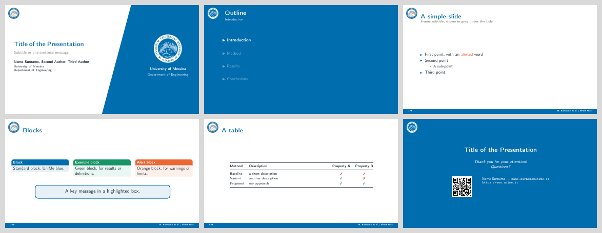

# UniMe Beamer template

A 16:9 LaTeX Beamer theme for presentations at the **University of Messina** (UniMe), Department of Engineering. The colours come from the UniMe seal.



## Contents

| Path | What it is |
|---|---|
| `template.tex` | An example deck covering every slide type. Copy it and rename it. |
| `beamerthemeunime.sty` | The theme: colours, title page, frame title, footline, section outlines, closing slide. |
| `assets/unime_logo.png` | The seal in its original colours, used on white slides. |
| `assets/unime_logo_white.png` | The white seal, used on blue areas. |
| `figures/` | Put your images here. It is already on `\graphicspath`. |
| `template.pdf` | The compiled example. |

## Usage

**Locally** (TeX Live 2022 or later):

```sh
latexmk -pdf template.tex
```

**On Overleaf:** zip the folder, then choose *New Project → Upload Project*. Compile it with pdfLaTeX.

The theme needs `tikz`, `lato` and `fontenc`. The example deck also uses `booktabs`, `tabularx`, `pifont`, `listings`, `qrcode` and `mwe`, which supplies the placeholder images.

## What the theme provides

- **Title page.** On the left: title, subtitle, authors and institute. On the right: a blue panel cut on a diagonal, showing the white seal with "University of Messina / Department of Engineering". The date is hidden when `\date{}` is empty.
- **Frames.** A colour seal at the top left, the title in UniMe blue, and an optional grey subtitle set with `\framesubtitle`.
- **Footline.** A blue bar with the frame number on the left, and the short author and short title on the right (`\author[...]`, `\title[...]`).
- **Section outlines.** Each `\section` opens a blue slide with the outline, highlighting the current section.
- **Closing slide.** `\closingframe{...}` produces a blue slide with the title and "Thank you for your attention! Questions?". Its argument prints below that, for contacts, a link or a QR code. Use `\closingframe{}` for none.
- **Colours.** These names work anywhere in the document:

  | Name | Hex | Use |
  |---|---|---|
  | `unimeblue` | #006DAE | Main colour |
  | `unimedark` | #004A78 | Darker shade |
  | `unimegrey` | #949493 | Grey |
  | `unimelight` | #E8F1F8 | Block backgrounds |
  | `unimeink` | #1F2A33 | Text |
  | `unimeorange` | #EB6834 | Alerts |
  | `unimegreen` | #1BAF7A | Example blocks |
  | `unimered` | #C62E2E | Red |

- **Blocks.** `block` is blue, `exampleblock` green, `alertblock` orange.

Coloured areas extend 2 mm past the page edge. Without this, many PDF viewers draw a thin light line along the border.

To change the department or institution on the blue panel, edit the two `\node` lines in the `title page` template of `beamerthemeunime.sty`.

## License

The LaTeX sources are released under the MIT License (see `LICENSE`).

The University of Messina name and seal belong to the University of Messina. They are not covered by the MIT License, and their use is subject to the University's rules.
